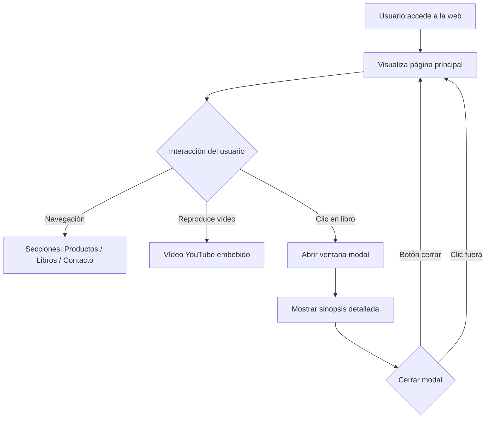

# InteligenciaArtificialVideoAudio (IAVA)

## Descripción general del proyecto

**InteligenciaArtificialVideoAudio (IAVA)** es un proyecto web desarrollado como práctica integradora que combina **contenidos audiovisuales**, **diseño web**, **interacción con el usuario** y **estructuración de información cultural**, todo ello enmarcado dentro de un contexto educativo relacionado con **Inteligencia Artificial aplicada a vídeo y audio**.

El proyecto se materializa en la **página web de una editorial ficticia llamada Books Nest**, concebida como una plataforma visual e interactiva orientada a la divulgación de literatura clásica, productos culturales y contenido multimedia (vídeo), utilizando tecnologías web estándar: **HTML, CSS y JavaScript**.

El objetivo principal es demostrar cómo pueden integrarse distintos formatos (texto extenso, imágenes, vídeo embebido e interacciones dinámicas) en una sola aplicación web coherente, accesible y atractiva.

---

## Objetivos del proyecto

* Diseñar una **web estática funcional** con estructura clara y navegación intuitiva.
* Integrar **contenido audiovisual** (vídeo de YouTube) dentro del flujo de la página.
* Presentar información cultural extensa (sinopsis literarias) de forma **no invasiva** mediante ventanas modales.
* Aplicar principios de **diseño visual coherente** (paleta de colores, tipografía y jerarquía visual).
* Implementar **interacción con JavaScript** sin uso de librerías externas.
* Servir como base para futuros desarrollos relacionados con **IA aplicada a audio, vídeo o recomendación de contenidos**.

---

## Relación con Inteligencia Artificial, Vídeo y Audio

Aunque esta versión del proyecto no implementa modelos de IA de forma directa, está diseñado como una **estructura base** sobre la que pueden añadirse funcionalidades inteligentes, como:

* Recomendación automática de libros mediante IA.
* Generación de audiolibros usando **Text-to-Speech**.
* Análisis de preferencias del usuario.
* Integración de resúmenes generados por IA.
* Clasificación automática de contenidos audiovisuales.

La inclusión de vídeo embebido y la organización modular del contenido facilitan futuras ampliaciones con sistemas inteligentes.

---

## Estructura del proyecto

El proyecto se organiza principalmente en un único archivo HTML que incluye:

* Estructura semántica del contenido.
* Estilos CSS embebidos.
* Código JavaScript para la interacción.

Además, se apoya en recursos externos (imágenes alojadas en GitHub y vídeo de YouTube).

```
IAVA/
│
├── Proyecto/
│   ├── Fotos/
│   │   ├── Logo.png
│   │   ├── Tazas.png
│   │   ├── Termos.png
│   │   ├── Bags.png
│   │   ├── Cuadernos.png
│   │   ├── Pines.png
│   │   ├── Caja.png
│   │   ├── OrgulloYPrejuicio.png
│   │   ├── AliciaEnElPaisDeLasMaravillas.png
│   │   ├── Arturo.png
│   │   ├── ElJardinSecreto.png
│   │   ├── CumbresBorrascosas.png
│   │   └── LaIslaDelTesoro.png
│   │
│   └── index.html
│
└── README.md
```

---

## Tecnologías utilizadas

### HTML5

* Estructura semántica del contenido.
* Uso de etiquetas como `header`, `section`, `nav`, `footer`.
* Inclusión de `iframe` para vídeo.

### CSS3

* Estilos embebidos en el documento.
* Uso de **Flexbox** para layouts responsivos.
* Diseño de tarjetas (cards) y modales.
* Paleta de colores coherente y temática literaria.

### JavaScript (Vanilla)

* Control de ventanas modales.
* Gestión de eventos de clic.
* Manipulación del DOM sin librerías externas.

---

## Funcionalidades principales

### 1. Navegación

* Menú superior fijo y claro.
* Enlaces internos a secciones de la página.

### 2. Vídeo destacado

* Integración de un vídeo de YouTube mediante `iframe`.
* Refuerzo del contenido audiovisual.

### 3. Productos destacados

* Visualización en formato grid.
* Uso de tarjetas con imagen, título y descripción.

### 4. Libros interactivos

* Cada libro se presenta como una tarjeta clicable.
* Al hacer clic se abre una **ventana modal**.
* Las ventanas contienen **sinopsis extensas**.

### 5. Ventanas modales

* Apertura mediante JavaScript.
* Cierre con botón o clic fuera del contenido.
* Diseño integrado con la estética general.

---

## Diagrama de flujo del funcionamiento

A continuación se muestra un diagrama de flujo que representa la interacción principal del usuario con la aplicación:



---

## Diseño y experiencia de usuario (UX/UI)

* **Estética cálida y literaria**, alineada con la temática del proyecto.
* Tipografías legibles y jerarquía visual clara.
* Uso de tarjetas para facilitar la exploración.
* Modales para evitar recargar visualmente la página principal.

---

## Posibles mejoras futuras

* Implementar **backend** para gestión dinámica de contenidos.
* Añadir **IA de recomendación** de libros.
* Integrar **audiolecturas** mediante síntesis de voz.
* Adaptar la web a **PWA** (Progressive Web App).
* Añadir accesibilidad avanzada (lectores de pantalla, subtítulos, etc.).

---

## Autoría

Proyecto desarrollado con fines educativos dentro del ámbito de:

* Desarrollo web
* Contenidos multimedia
* Introducción a Inteligencia Artificial aplicada a vídeo y audio

---

## Frase representativa

> *“Publicamos sueños, página a página”*

---

